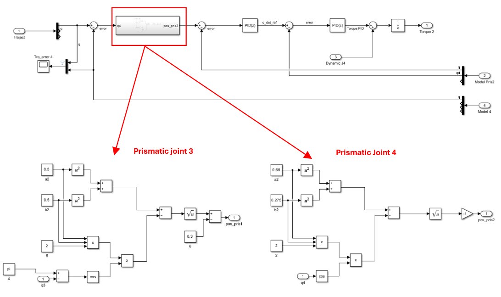

<h1>FRA333: SIMULATION AND TRAJECTORY PLANNING OF BACKHOE ARM USING FORWARD KINEMATICS AND DYNAMIC ANALYSIS </h1>
<h2>จัดทำโดย</h2>

1. ชัยภัทร นิลประภา 65340500016

2. พิมพ์ณภัทร ปูอินต๊ะ 65340500072

3. ชนัญญ์ทิชา โพธิ์พันธ์ 65340500078

<h2>บทนำ</h2>

โปรเจคนี้เป็นการพัฒนาโปรแกรมจำลองการเคลื่อนที่ของแขนกลแบคโฮ (Backhoe) 
โดยคำนวณหาตำแหน่งการหมุนของแต่ละมุมข้อต่อ เพื่อให้ได้ตำแหน่งปลาย End Effector ที่ต้องการ 
ของระบบ Open Loop Kinematic Chain ในการจำลองนี้จะอ้างอิงความยาวของ link แต่ละส่วน 
(Boom, Arm, Bucket และ Rotate Base) และมุมของข้อต่อ (Joint Angles) ของแบคโฮที่ใช้งาน 
โดยเฉพาะ Rotate Base ซึ่งเป็นส่วนฐานที่สามารถหมุนได้ 360 องศา 
ทำให้เพิ่มระดับความอิสระ (Degrees of Freedom) จากเดิม 3 DoF เป็น 4 DoF 
เพื่อให้ครอบคลุมทุกมิติของการเคลื่อนที่ของแขนกลแบคโฮ 
การคำนวณหาตำแหน่งการหมุนของแต่ละมุมข้อต่อ จะใช้หลักการ Inverse Kinematics 
ร่วมกับ Forward Kinematics เพื่อสร้างแบบจำลองการเคลื่อนที่ให้ใกล้เคียงความเป็นจริง 
สำหรับการวางแผนเส้นทาง Trajectory Planning นำมาใช้เพื่อวางแผนการเคลื่อนที่ของแขนกลแบคโฮให้ต่อเนื่อง 
โดยกำหนดตำแหน่ง ความเร็ว และความเร่งของแขนกลในแต่ละช่วงเวลา 
ทางผู้จัดได้มีการคำนวณ Dynamic Analysis เพื่อทำการจำลองแรงที่เกิดขึ้นโดยการเพิ่มน้ำหนักบริเวณปลายแขน End Effector 
โดยคำนึงถึงแรงที่กระทำในแต่ละข้อต่อและปลาย End Effector 
เพื่อให้สามารถวิเคราะห์และประเมินผลกระทบจากแรงที่เกิดขึ้นระหว่างการทำงาน

<h2>วัตถุประสงค์</h2>

 2.1 เพื่อศึกษาการทำงานของระบบ Open Loop Kinematic Chain ในปริภูมิ 3 มิติ สำหรับความยาวของ Link แต่ละส่วน (Boom, Arm, Bucket, Rotate Base) และ มุมการหมุนในข้อต่อ (Joint Angles)

 2.2 เพื่อศึกษาการจำลองแบบ Dynamic ในการทำงานของแขน Backhoe ขณะตักดิน โดยคำนึงถึงแรงที่กระทำในแต่ละข้อต่อ และการวิเคราะห์การเปลี่ยนแปลงของแรงบิดที่เกิดขึ้น

 2.3 เพื่อศึกษาการวางแผนเส้นทางและการควบคุมการเคลื่อนที่ของ Backhoe โดยออกแบบ Trajectory Planning สำหรับการกำหนดเส้นทางและตำแหน่งในการเคลื่อนที่ของแขนกล

<h2>System overview</h2>

# Forward Kinematic

## บทนำ
โปรเจคนี้เป็นการคำนวณตำแหน่งปลายมือ (End Effector) ของแขนกล โดยการกำหนดค่ามุมของแต่ละข้อต่อ (Joint Angles) ด้วยหลักการ **Forward Kinematics** ซึ่งใช้หลักการ Denavit-Hartenberg (DH) ในการกำหนดพิกัดเชิงเส้นและเชิงมุมสำหรับแต่ละข้อต่อในระบบ Open Loop Kinematic Chain

พารามิเตอร์ DH ที่ใช้ในการคำนวณและสร้างแบบจำลองการเคลื่อนที่ ประกอบด้วย 4 พารามิเตอร์ต่อข้อต่อ 1 จุด หรือ 1 ลิงค์ ดังนี้:

| ข้อต่อ (Joint) | Ai | αi | Di           | Θi          |
|------------------|---------------|---------------|-------------------------|-------------------------|
| 1                | 0             | 0             | D1+L1 | Θ1          |
| 2                | A1 | 90            | 0                       | Θ2          |
| 3                | L2 | 0             | 0                       | 90+Θ3       |
| 4                | L3 | 0             | 0                       | Θ4          |
| 5                | L4 | 0             | 0                       | 0                       |

### คำอธิบาย DH Parameters:
- **Θi** = มุมระหว่างแกน Zi-1 และ Zi
- **Di** = ระยะห่างเชิงเส้นระหว่างแกน Zi-1 และ Zi วัดในระนาบ Zi-1
- **Ai** = ระยะห่างเชิงเส้นระหว่างแกน Xi-1 และ Xi วัดในระนาบ Xi-1
- **αi** = การหมุนรอบแกน Xi-1
- **Li** =  ความยาวของแต่ละลิงค์

---

## การคำนวณเมทริกซ์การแปลง (Transformation Matrix)
เพื่อคำนวณตำแหน่งและการหมุนของปลายแขนกล (End Effector) จะใช้ **เมทริกซ์การแปลง (Transformation Matrix)** ซึ่งคำนวณทีละข้อต่อโดยมีสูตรดังนี้:

โดย:
- **Ai**: เป็นเมทริกซ์การแปลงของข้อต่อ `i` ที่แสดงการแปลงพิกัดจากข้อต่อ `i-1` ไปยังข้อต่อ `i`

เพื่อคำนวณตำแหน่งของปลายแขน (End Effector) เมื่อมีหลายข้อต่อ จะต้องคูณเมทริกซ์การแปลงระหว่างข้อต่อทั้งหมดเข้าด้วยกัน:
T = A1 × A2 × A3 × … × An

โดย:
- **T**: เมทริกซ์การแปลงสุดท้ายที่บ่งบอกถึงตำแหน่งและการหมุนของปลายแขนในระบบพิกัดฐาน (Base Frame)

---

## การแยกตำแหน่งและการหมุน
จากเมทริกซ์การแปลงสุดท้าย (T) สามารถแยกส่วนที่เกี่ยวข้องดังนี้:
1. **ตำแหน่ง (Position)** = ใช้ค่าในแถวที่ 4 คอลัมน์ที่ 1 ถึง 3 ซึ่งก็คือ `[X, Y, Z]`
2. **การหมุน (Rotation)** = ใช้ส่วนของเมทริกซ์การหมุน (Rotation Matrix) ที่อยู่ในมุมซ้ายบน ขนาด 3×3

---
# Inverse Kinematics

การคำนวณ Inverse Kinematics เป็นการหาค่ามุมของแต่ละข้อต่อที่สอดคล้องกับตำแหน่งปลายมือ (End Effector) ที่กำหนด โดยอ้างอิงจาก Forward Kinematics เพื่อให้ได้ค่ามุมที่เหมาะสมสำหรับแต่ละข้อต่อ โดยสามารถคำนวณตำแหน่งของแต่ละข้อต่อได้ดังนี้:

---

สมการการคำนวณมุมข้อต่อ:
- Θ1 = atan2(py, px)
- Θ2 = atan2(sinΘ2, cosΘ2)
- Θ3 = atan2(sinΘ3, cosΘ3)
- Θ4 = atan2(NZ, OZ) - Θ2 - Θ3

---

โดยที่
- sinΘ2 = (BC - AD) / (C2 + D2)
- cosΘ2 = √(1 - sin2Θ2)

- cosΘ3 = (A2 + B2 - L22 - L32) / (2 × L2 × L3)
- sinΘ3 = √(1 - cos2Θ3)

---

เเละ
- A = px × cosΘ1 + py × sinΘ1 - a1 - L4
- B = pz - (d1 + L1) - L4
- C = L2 + L3 × cosΘ3
- D = L3 × sinΘ3
  
---
# Dynamic 
## บทนำ

---
# Trajectory Planning

ทางผู้จัดทำได้เลือกใช้ quintic polynomial trajectory เนื่องจากเป็นสมการพหุนามดีกรีที่ 5 ซึ่งสามารถคำนวณตำแหน่ง (q) ความเร็ว (qd) และความเร่ง (qdd) ของจุดที่ต้องการเคลื่อนที่ได้อย่างราบรื่นในช่วงเวลาที่กำหนด T โดยอ้างอิงจากเงื่อนไขที่กำหนดไว้ในจุดเริ่มต้นและจุดสิ้นสุด

## การทำงานของฟังก์ชัน

### อินพุต (Inputs)
- **qf**: ตำแหน่งของข้อต่อในแต่ละส่วน
- **t**: เวลาปัจจุบัน

### เอาต์พุต (Outputs)
- **q**: ตำแหน่ง ณ เวลาที่กำหนด (t)
- **qd**: ความเร็ว ณ เวลาที่กำหนด (t)
- **qdd**: ความเร่ง ณ เวลาที่กำหนด (t)

### กำหนดค่าสภาวะเริ่มต้นและสุดท้าย
- **q0** = 0: ตำแหน่งเริ่มต้น
- **qd** = 0: ความเร็วเริ่มต้น
- **qdd** = 0: ความเร่งเริ่มต้น
- **qdf** = 0: ความเร็วสุดท้าย
- **qddf** = 0: ความเร่งสุดท้าย
- **T** = 0.5: ระยะเวลารวมของการเคลื่อนที่ (ครึ่งวินาที)

---

## รูปแบบสมการ Quintic Polynomial
สมการ quintic polynomial มีดังนี้:

q(t) = a0 + a1 t + a2 t2 + a3 t3 + a4 t4 + a5 t5

โดยที่:
- **q(t)** : ค่าตำแหน่ง ที่เวลา t
- **a0,a1,a2,a3,a4,a5** : ค่าสัมประสิทธิ์ที่ต้องการหา

---

ตำแหน่ง **q** คำนวณจากสมการพหุนาม:

q(t) = a0 + a1 t + a2 t2 + a3 t3 + a4 t4 + a5 t5

ความเร็ว **qd** คำนวณจากอนุพันธ์ลำดับแรกของสมการตำแหน่ง:

qd(t) = a1 + 2a2 t + 3a3 t2 + 4a4 t3 + 5a5 t4 

ความเร่ง**qdd** คำนวณจากอนุพันธ์ลำดับที่สองของสมการตำแหน่ง

qd(t) = 2a2 + 6a3t+ 12a4 t2 + 20a5 t2 

---
# Control

ทางผู้จัดทำได้แบ่งบล็อก control ออกเป็น 2 ส่วน ได้แก่:

1. **Revolute joints control**  
   สำหรับควบคุม Rotate base (Joint 1) และ Boom (Joint 2)

2. **Prismatic joints control**  
   สำหรับจำลองเป็นระบบไฮดรอลิกโดยควบคุม Arm (Joint 3) และ Bucket (Joint 4)

---

## การทำงานของฟังก์ชัน

อินพุต (Inputs):

- **q**: ตำแหน่ง ณ เวลาที่กำหนด (t)  
- **qd**: ความเร็ว ณ เวลาที่กำหนด (t)  

เอาต์พุต (Outputs):

- **Torque**: แรงบิดที่กระทำต่อ Rotate base (Joint 1) และ Boom (Joint 2)  
- **Force**: แรงที่กระทำต่อ Arm (Joint 3) และ Bucket (Joint 4)  

---

Revolute joints control:

- ประกอบด้วยตัวควบคุม **PID สำหรับตำแหน่ง (Position PID)** และ **PID สำหรับความเร็ว (Velocity PID)**  
- รับสัญญาณความคลาดเคลื่อน (error) จากข้อมูลจริงที่ได้จากแบบจำลอง พร้อมทั้งนำค่าแรงที่ได้จากการคำนวณไดนามิกมาประกอบการควบคุม  
- ให้ผลลัพธ์สุดท้ายอยู่ในรูปของแรงบิด (**Torque**)

---

Prismatic joints control:

- องค์ประกอบของระบบเหมือนกับบล็อก Revolute joints control แต่มีการเพิ่มบล็อกสำหรับแปลงสัญญาณตำแหน่งจากข้อต่อแบบหมุน (**revolute joint**) ให้เป็นตำแหน่งการเคลื่อนที่เชิงเส้น (**prismatic joint**)  
- ใช้หลักการคำนวณระยะการเคลื่อนที่ตาม **กฎของโคไซน์** เพื่อใช้ในการจำลองระบบไฮดรอลิกได้อย่างแม่นยำ  
- บล็อกดังกล่าวจะถูกวางไว้ลำดับก่อนบล็อกควบคุม **PID สำหรับตำแหน่ง (Position PID)**  
- ให้ผลลัพธ์สุดท้ายอยู่ในรูปของแรง (**Force**)
  
---
รูปแบบสมการกฎของโคไซน์:
- สำหรับ Prismatic joints 3: **b2** = **a2**  + **c2**  - **2accos(B)**
- สำหรับ Prismatic joints 4: **a2** = **b2**  + **c2**  - **2bccos(A)**

โดย:
- **b**: ความยาวด้านตรงข้ามมุม B  
- **a** และ **c**: ความยาวของด้านที่อยู่ติดกับมุม B  
- **B**: มุมระหว่างด้าน a และ c

---
# DOF model 
## บทนำ

---
</body>
</html>
